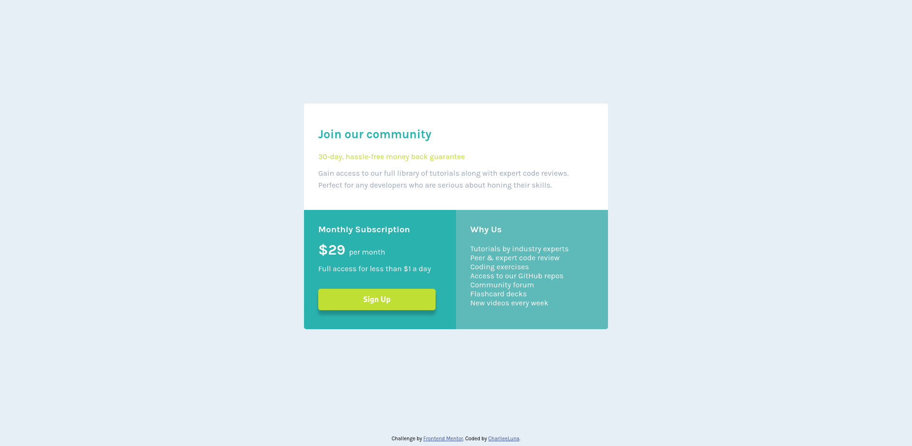

# Frontend Mentor - Single price grid component solution

This is a solution to the [Single price grid component challenge on Frontend Mentor](https://www.frontendmentor.io/challenges/single-price-grid-component-5ce41129d0ff452fec5abbbc). Frontend Mentor challenges help you improve your coding skills by building realistic projects. 

## Table of contents

- [Overview](#overview)
  - [The challenge](#the-challenge)
  - [Screenshot](#screenshot)
  - [Links](#links)
- [My process](#my-process)
  - [Built with](#built-with)
  - [What I learned](#what-i-learned)
  - [Continued development](#continued-development)
  - [Useful resources](#useful-resources)
- [Author](#author)
- [Acknowledgments](#acknowledgments)

## Overview

### The challenge

Users should be able to:

- View the optimal layout for the component depending on their device's screen size
- See a hover state on desktop for the Sign Up call-to-action

### Screenshot

### Links

- Solution URL: ([https://github.com/CharlieeLuna23/single-price-grid.git)
- Live Site URL: (https://charlieeluna23.github.io/single-price-grid/)

## My process

### Built with

- Semantic HTML5 markup
- CSS custom properties
- CSS Grid
- Mobile-first workflow

### What I learned

How to add button "on-click" effects. It was not required but the button seemed pretty boring for me.

### Continued development

To continue practicing with grid-templates as I had a hard time figuring out the layout as all the previous projects I've worked with have been styled with flex.

### Useful resources

- [Example resource 1](https://blog.stackfindover.com/button-click-effect-css/) - This helped me get ideas for the button "on-click" effect.

## Author

- FreeCodeCamp - [CharlieeLuna](https://www.freecodecamp.org/CharlieeLuna)
- Frontend Mentor - [@CharlieeLuna23](https://www.frontendmentor.io/profile/CharlieeLuna23)
- Twitter - [@CharlieeLuna](https://twitter.com/CharlieeLuna)

## Acknowledgments

Once again to my cats for making me company during this learning process and path.
